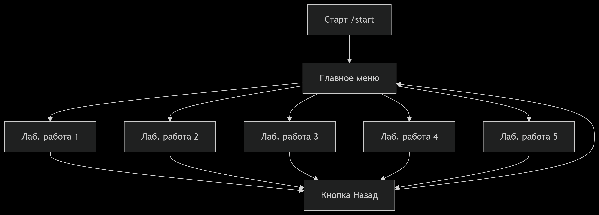
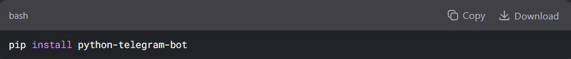
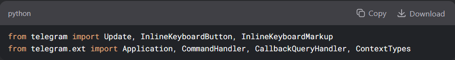
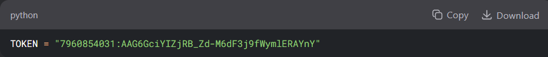
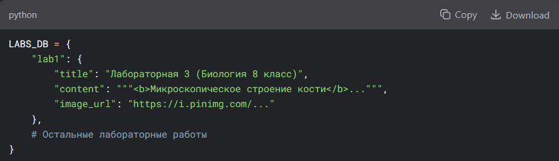
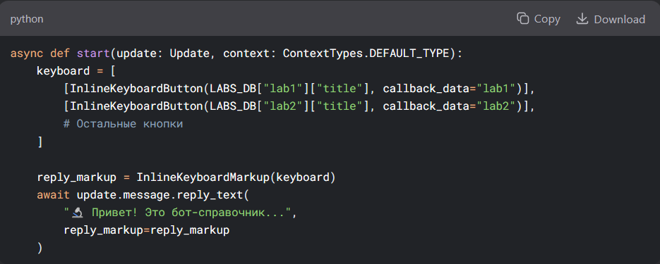
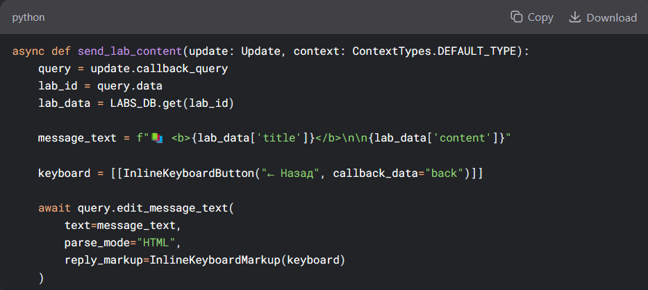
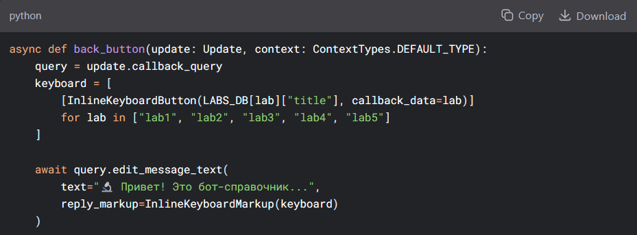
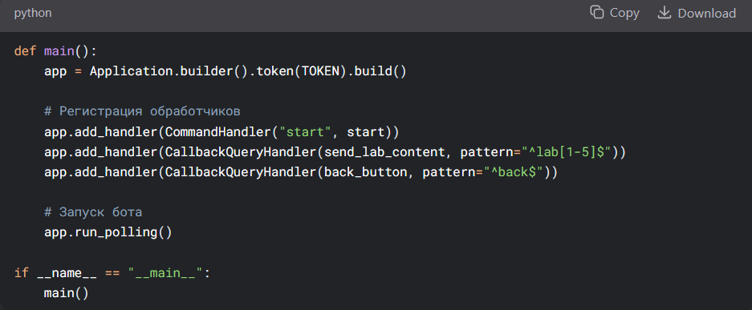
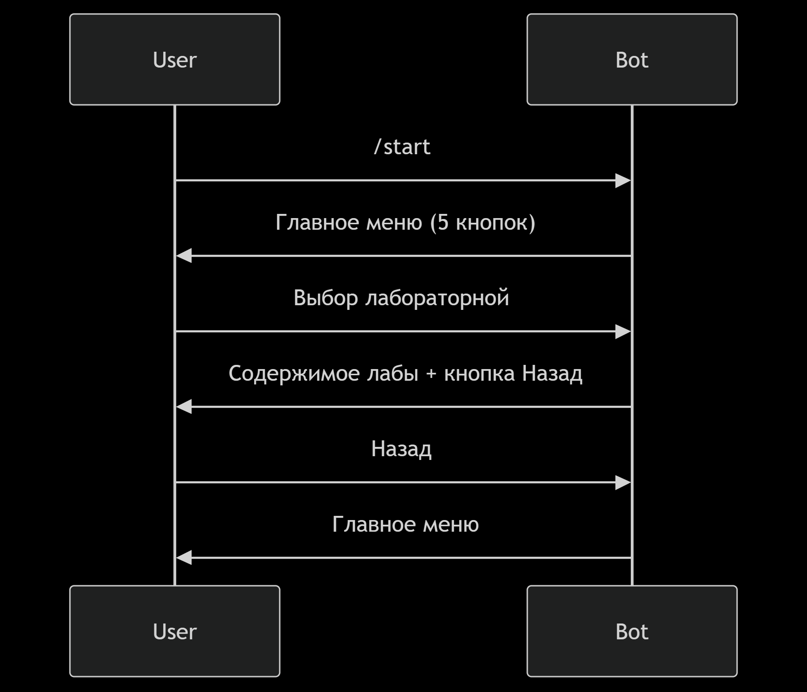

<h1 align="left">Техническое руководство по созданию телеграмм – бота приложения «Виртуальная лаборатория»</h1>

<h2 align="left">Введение</h2>
Telegram бот "Виртуальная лаборатория" предназначен для помощи учащимся 8-9 классов в выполнении лабораторных работ

Бот предоставляет: 
Подробные инструкции по выполнению лабораторных работ 
Теоретические материалы 
Описания химических реакций и физических экспериментов 
Изображения и схемы 

<h2 align="left">Архитектура проекта</h2>

<h2 align="left">Процесс создания</h2>

<h3 align="left">Требования</h3>
•  Python 3.9+  

<h3 align="left">Настройка окружения</h3>
Установка необходимых библиотек

<h3 align="left">Структура кода</h3>
1.  Импорт библиотек

2.  Конфигурация бота

3.  База данных лабораторных работ

4.  Функция старта (/start)

5.  Отправка содержимого лабораторной работы

6. Обработка кнопки "Назад"

<h3 align="left">Настройка обработчиков и запуск бота</h3>

<h3 align="left">Схема работы бота</h3>

<h2 align="left">Заключение</h2>
Бот экономит время на поиск информации и помогает в подготовке к занятиям. 

